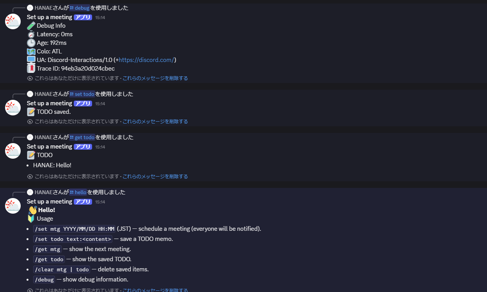

## Discord Bot 概要

このリポジトリの Cloudflare Worker は、Discord のスラッシュコマンドでミーティングの予約と TODO メモの管理を行うボットです。Durable Object でスケジュールとメモを永続化し、指定時刻の10分前と開始時刻に自動でチャンネルへ通知します。

### 主な機能

- ミーティング予約: `/set mtg when:YYYY/MM/DD HH:MM`（JST）。T-10 と T の2回通知します。
- TODO 登録: `/set todo text:<内容>`。ユーザーごとに1件を保持し、再登録で上書きします。
- 参照: `/get mtg` で次回ミーティング、`/get todo` でTODO一覧を表示します。
- クリア: `/clear mtg` または `/clear todo` で個別に削除。`/clear` で全消去。
- 使い方表示: `/hello` でコマンドの使い方を表示します。
- デバッグ: `/debug` でレイテンシ、colo、UA、トレースIDなどを表示します。

すべてのスラッシュコマンドの応答はエフェメラル（`flags: 64`）です。

### 通知内容とメンション

- T-10: `⏰ 会議開始10分前です！`
- T: `🟢 会議開始です！`
- 本文には開始時刻（JST）と、保存されている TODO リスト（ユーザー名とテキスト）を含みます。
- 既定では `@everyone` にメンションします。実装上は `here`/`everyone`/`role:<ID>`/`user:<ID>` に対応しています（スラッシュコマンドからは既定の `everyone` を使用）。

### アーキテクチャ

- エンドポイント: `POST /interactions`
  - `x-signature-ed25519` と `x-signature-timestamp` を `DISCORD_PUBLIC_KEY` で検証します。
  - PING(1) は PONG を返却。APPLICATION_COMMAND(2) で各コマンドを処理します。
- Durable Object: `SchedulerDO`
  - キュー（T-10/Tの2件）と TODO を DO ストレージに保持。
  - `setAlarm` を用いて次の実行時刻を武装（arm）し、時刻到来で Discord API へ通知を送信します。
- Discord 送信: `https://discord.com/api/v10/channels/{channelId}/messages`
  - `DISCORD_BOT_TOKEN` を使用し、allowed_mentions を適切に設定して送信します。

### Bot招待リンク
https://discord.com/oauth2/authorize?client_id=1410966251232165889&permissions=2147617792&integration_type=0&scope=bot+applications.commands
